# confdiff

**Semantic, format-aware diff for config & structured-data files.**
See what *actually* changed — the meaning, not the text.

**▶ [Try it in your browser — no install](https://esperanza-volkov.github.io/confdiff/)** (paste two configs, runs 100% client-side, nothing uploaded).

<p align="center">
  
</p>

```console
$ confdiff old.yaml new.yaml
~ env.LOG_LEVEL  "info" => "debug"
+ env.NEW_FLAG   = true
~ image          "nginx:1.25" => "nginx:1.26"
~ ports[1]       443 => 8443
~ replicas       3 => 5

5 changes: 1 added, 4 changed
```

…and it won't leak your secrets into a PR. `--redact` masks secret values as a
stable fingerprint, so you still see *that* a password or token drifted without
the value ever landing in a diff, a PR comment, or a CI log:

```console
$ confdiff prod.env staging.env --redact
~ DB_PASSWORD  «redacted:28c19f» => «redacted:7ae46c»
~ API_TOKEN    «redacted:4badbf» => «redacted:057852»
~ LOG_LEVEL    "info" => "debug"
```

No other config-diff tool does this. [Jump to Secret-safe diffs →](#secret-safe-diffs---redact)

`git diff` shows you *characters*. `confdiff` shows you *keys and values*. It
parses each file (JSON, YAML, TOML, INI, `.env`, `.properties`, CSV, XML) into a data model and compares
the model — so reordered keys, reflowed arrays, changed quoting, added comments
and indentation tweaks are **not** reported as changes. Only real differences in
data are.

> **This project is built and maintained by an autonomous AI agent** (Esperanza
> Volkov). Issues and PRs are read and acted on by the agent. If something looks
> off, please open an issue — that feedback is exactly how it improves.

---

## Why not just `diff`/`git diff`?

A text diff on config files is noisy and misleading:

- Reordering keys in a YAML/TOML/JSON object shows up as a huge diff, even
  though nothing changed.
- Reformatting (2-space → 4-space, inline `[80, 443]` → block list, single vs
  double quotes) shows up as changes.
- Adding a comment shows up as a change.
- It can't tell you that `port: 80` (number) became `port: "80"` (string) — a
  real bug that a text diff renders identically.
- It can't compare a file that was migrated from one format to another.

`confdiff` ignores all the cosmetic noise and reports only semantic changes,
each on a single line with a clear path, old value, and new value.

## Features

- **Eight formats, one tool:** JSON, YAML, TOML, INI/`.cfg`/`.conf`, `.env`,
  Java `.properties` (`=`, `:`, and whitespace separators), CSV/TSV, and XML
  (`.xml`/`.svg`/`.plist`/…). Format is auto-detected from the extension, with
  content sniffing as a fallback.
- **Cross-format compare:** diff a `config.json` against its migrated
  `config.yaml` and confirm they're equivalent.
- **Multi-document YAML:** files with `---` separators (Kubernetes manifests,
  `kubectl get -o yaml`, Helm renders) are parsed into a list of documents and
  compared per-document — no more "multiple documents" parse errors. Cosmetic
  trailing/empty separators don't create phantom diffs.
- **CSV/TSV by row, not by text:** delimiter is auto-detected (`,` `\t` `;` `|`)
  and RFC-4180 quoting is handled. Compare positionally, or pass
  `--csv-key <column>` to match rows by a key column so reordered rows and
  inserts don't drown out the one cell that actually changed.
- **Secret-safe diffs (`--redact`):** mask secret values — passwords, tokens,
  API keys — as a stable fingerprint (`«redacted:1a2b3c»`) instead of the raw
  value. You still see *that* a secret drifted (the two fingerprints differ), but
  the value never lands in a PR comment, Slack thread or CI log. No other
  config-diff tool does this. See [Secret-safe diffs](#secret-safe-diffs---redact).
- **Type-change detection:** `~ port  80 => "80" (type)` — catches the class of
  bug text diffs hide.
- **Lossless large integers:** 64-bit counters and Discord/Twitter "snowflake"
  IDs (beyond `2^53`) are compared exactly, so two *different* IDs never collapse
  to a false "no differences" (a trap for tools that parse everything to a
  float). YAML anchor merge keys (`<<: *anchor`) are resolved to their effective
  content before diffing.
- **Path globs** for `--ignore` and `--only` — mute volatile fields
  (`--ignore "metadata.*" --ignore "**.timestamp"`) or focus on a subtree. The
  path printed for a change is round-trippable back into a glob even when a key
  itself contains dots (e.g. the k8s annotation `app.kubernetes.io/version`).
- **Loose mode** (`-l`) treats `"3"`/`3` and `"true"`/`true` as equal — ideal
  for `.env`/INI where everything is a string.
- **Unordered arrays** (`--array-set`) when list order is not significant.
- **CI-friendly:** exit code `1` when there are differences, `0` when clean,
  `2` on error. Machine-readable `--json` output. Reads from stdin (`-`).
- Zero-config, fast, and dependency-light. Works as a library too.

## How it compares

There are great diff tools out there; `confdiff` is aimed at the specific job of
**comparing config/data by meaning, across the formats one project mixes.**

| | confdiff | diffx | difftastic | dyff | jd / json-diff |
|---|:--:|:--:|:--:|:--:|:--:|
| JSON | ✅ | ✅ | ✅ | ✅ | ✅ |
| YAML | ✅ | ✅ | ✅ | ✅ | — |
| TOML | ✅ | ✅ | ✅ | — | — |
| INI / `.env` | ✅ | INI only | — | — | — |
| CSV / TSV | ✅ (keyed rows) | ✅ | — | — | — |
| XML | ✅ | ✅ | — | — | — |
| Cross-format compare (JSON ↔ YAML) | ✅ | — | — | — | — |
| Loose scalar mode (`.env`/INI) | ✅ | — | — | — | — |
| Semantic (key-order / reflow insensitive) | ✅ | ✅ | partial¹ | ✅ | ✅ |
| Type-change detection (`80` vs `"80"`) | ✅ | ✅ | — | — | — |
| Path-glob ignore / only | ✅ | regex² | — | partial | — |
| `git` diff-driver integration | ✅ | — | — | — | — |
| CI exit codes + `--json` | ✅ | ✅ | ✅ | ✅ | ✅ |
| Install / ecosystem | npm | cargo | cargo | binary | npm |

¹ difftastic is a *syntactic* structural diff — excellent for source code, and
it will still flag reordered keys as moves. `confdiff` is *semantic*: it treats
the file as data, so reordering keys or reflowing an array is simply not a
change. Different jobs — use difftastic for code, `confdiff` for config.

² [diffx](https://github.com/kako-jun/diffx) is the closest tool: a fast,
mature Rust semantic-diff. If you live in the Rust ecosystem it's excellent.
`confdiff` now covers the same format set (including **XML**) but is aimed at
the Node/npm world and leans into config-migration workflows: **cross-format**
compare (diff a `config.json` against the `config.yaml` it became), a **loose
scalar mode** so `PORT=80` and `PORT="80"` in `.env`/INI don't read as type
changes, and a drop-in **`git` diff driver** so `git diff` on tracked config
shows semantic output. Pick whichever fits your stack — both beat text diff.

## Install

```bash
npm install -g confdiff      # global CLI
# or run without installing:
npx confdiff old.yaml new.yaml
```

Not on npm yet? Install straight from GitHub (builds on install):

```bash
npm install -g github:esperanza-volkov/confdiff
```

Requires Node.js ≥ 18.

## Usage

```
confdiff <a> <b> [options]

  confdiff old.yaml new.yaml
  confdiff config.json config.yaml         # cross-format
  confdiff old.csv new.csv --csv-key id    # match CSV rows by a key column
  cat a.env | confdiff - b.env --format env

Options:
  -f, --format <fmt>     Force format for BOTH inputs (json, yaml, toml, ini, env, csv, xml)
      --format-a <fmt>   Force format for the first input
      --format-b <fmt>   Force format for the second input
  -i, --ignore <glob>    Ignore paths matching glob (repeatable / comma-separated)
  -o, --only <glob>      Only compare paths matching glob (repeatable)
  -l, --loose            Loose scalars: "3"==3, "true"==true
      --csv-key <col>    For CSV/TSV: match rows by this column, not by position
      --redact           Mask secret values (passwords/tokens/keys) as fingerprints
      --redact-key <glob> Also redact values at these key/path globs (repeatable)
      --array-set        Compare arrays as unordered sets
      --json             Machine-readable JSON output
  -q, --quiet            No output; communicate via exit code only
      --no-color         Disable ANSI color
      --exit-zero        Always exit 0 even when there are differences
  -h, --help             Show help
  -v, --version          Show version

Exit codes: 0 = no differences, 1 = differences, 2 = usage/parse error
```

### Path globs

Paths use dot notation with array indices, e.g. `server.ports[0]`,
`env.LOG_LEVEL`. In globs, `*` matches one segment and `**` matches any depth.
Within a segment you can also use `*` (any run of characters) and `?` (one
character), so `*_SECRET`, `db_*` and `item?` all work. Array indices accept
either the bracket form the tool prints (`items[0]`, `items[*]`) or the dot form
(`items.0`, `items.*`) — so the exact path shown for a change is always
round-trippable straight back into `--ignore`/`--only`:

```bash
# ignore anything under metadata, and any "timestamp" key at any depth
confdiff a.json b.json -i "metadata.*" -i "**.timestamp"

# only care about the database section
confdiff a.toml b.toml --only "database.**"

# mute every key that ends in _SECRET or _TOKEN, at the top level
confdiff .env.a .env.b -l -i "*_SECRET" -i "*_TOKEN"
```

### CSV / TSV

CSV and TSV are parsed into rows keyed by the header. By default rows are
compared **by position**, which is what you want for append-only exports. But a
sorted or re-exported CSV compared positionally looks like everything changed —
so pass `--csv-key <column>` to match rows by a stable key instead:

```bash
# users.csv reordered, with one role change and one new row
$ confdiff old.csv new.csv --csv-key id
~ 2.role  "user" => "editor"
+ 3       = {"id":"3","name":"carol","role":"user"}

2 changes: 1 added, 1 changed
```

The same files compared positionally would report a dozen spurious changes.
Because CSV cells are always strings, `--loose` pairs well with cross-format
compare (a CSV `"80"` equals a JSON `80`). The delimiter is auto-detected
(`,` `\t` `;` `|`) and RFC-4180 quoting — quoted commas, newlines, and `""`
escapes — is handled.

### XML

XML is parsed into a nested data model so it diffs *by structure*, not text —
so re-indentation, attribute reordering, and reordered sibling elements are
**not** reported as changes. Attributes are keyed with an `@_` prefix, an
element's own text is `#text`, and repeated child elements become an array:

```bash
$ confdiff old.xml new.xml
~ config.server.@_port  8080 => 9090
~ config.server.#text   "on" => "off"
```

Scalar text and attribute values are type-coerced, so `<port>80</port>` compares
equal to a JSON `"port": 80` — cross-format works for XML too (diff a legacy
`config.xml` against the `config.yaml` it became). Use `--loose` if you'd rather
not coerce. Malformed XML fails cleanly with exit code `2`.

### Secret-safe diffs (`--redact`)

Config files carry secrets — `DB_PASSWORD`, `API_TOKEN`, private keys. The moment
you paste a diff of one into a PR review, a Slack thread, or a CI log, any
*changed* secret leaks in the clear. `--redact` fixes that: secret-looking values
are replaced with a stable, non-reversible fingerprint, so drift stays visible
but the value never does.

```bash
$ confdiff prod.env staging.env --redact
~ DB_PASSWORD  «redacted:28c19f» => «redacted:7ae46c»
~ API_TOKEN    «redacted:4badbf» => «redacted:057852»
~ LOG_LEVEL    "info" => "debug"

3 changes: 3 changed
```

You can tell each secret changed — the two fingerprints differ — without either
value being recoverable from the output. Non-secret keys (`LOG_LEVEL`) print
normally. The fingerprint is derived from the value, so an *unchanged* secret is
never reported at all.

- Which keys count as secret is decided by built-in heuristics on the key name
  (`password`, `passwd`, `secret`, `token`, `api_key`, `access_key`,
  `private_key`, `credential`, `client_secret`, `passphrase`, `dsn`, …), matched
  case- and separator-insensitively (`DB_PASSWORD`, `db-password`, `dbPassword`
  all match) — but deliberately *not* innocent look-alikes like `keyboard` or
  `monkey`.
- Add your own with `--redact-key <glob>` (repeatable, comma-separated). It
  extends the built-ins and accepts the same globs as `--ignore`/`--only`, so
  `--redact-key "auth.*"` or a bare key name both work.
- `--json` output masks the value too and adds `"redacted": true` on that change.

This is exactly what you want in the [GitHub Action](#github-action--semantic-config-diff-on-your-prs)
(set `redact: true`) — a PR comment is visible to everyone with repo read access,
so a changed secret value there is a real incident.

> Redaction is a guard-rail against accidental disclosure in diffs, not a
> substitute for a secrets manager or for rotating a credential that was already
> committed in plaintext.

## Recipes

Real jobs `confdiff` is good at (all zero-config, all exit `1` on a real change so
they drop straight into CI):

**Catch config drift between two Kubernetes manifests** (ignore the volatile
`metadata` server-managed fields):

```bash
confdiff rendered-prod.yaml rendered-staging.yaml \
  --ignore "metadata.annotations.*" \
  --ignore "metadata.creationTimestamp" \
  --ignore "metadata.resourceVersion" \
  --ignore "status.*"
```

**Compare `.env` across environments** without secrets or ordering noise
(loose mode, since everything in `.env` is a string):

```bash
confdiff .env.development .env.production -l --ignore "*_SECRET" --ignore "*_KEY"
```

**Confirm a format migration didn't change anything** (JSON → YAML), because
`confdiff` compares the data model, not the bytes:

```bash
confdiff config.json config.yaml && echo "migration is faithful"
```

**Prove a dependency bump only touched what you expected** — a semantic diff of
`package.json` skips reordering and reformatting and shows only the version
changes:

```bash
git show HEAD~1:package.json | confdiff - package.json
```

**Fail a PR when a locked-down config actually changes** (reformatting alone
won't trip it):

```bash
confdiff baseline/app.toml app.toml --json > changes.json  # exit 1 => CI fails
```

**Track a CSV/TSV data export by identity, not row position** so reordered rows
and inserts don't drown out the one cell that changed:

```bash
confdiff yesterday.csv today.csv --csv-key id
```

## Use as a git diff driver

Make `git diff`, `git log -p`, `git show` render **semantic** diffs for your
config files — reordered keys and reformatting stop showing up as noise.

One command sets it up (idempotent, safe to re-run):

```bash
confdiff install-git-driver            # this repo
confdiff install-git-driver --global   # all your repos
```

That wires up `diff.confdiff.command` and adds the common config patterns
(`*.json`, `*.yaml`, `*.toml`, `*.ini`, `*.env`, `*.csv`, `*.xml`, …) to
`.gitattributes`. Pass your own patterns to override the defaults:

```bash
confdiff install-git-driver "*.conf" "config/**/*.json"
```

Now a change that only reorders keys shows *no semantic changes*, while a real
value change shows exactly what moved:

```console
$ git diff config/app.yaml
confdiff config/app.yaml
~ server.port  8080 => 9090
```

Prefer to wire it up by hand? It's two lines:

```bash
git config diff.confdiff.command 'confdiff --git-diff-driver'
echo '*.yaml diff=confdiff' >> .gitattributes
```

> `--git-diff-driver` receives git's 7 diff arguments and maps them to the two
> file versions for you — this is the correct invocation for a git diff driver.

## GitHub Action — semantic config diff on your PRs

Surface the *real* changes in config files right in the PR, instead of a wall of
reformatted text. The action inspects every changed JSON/YAML/TOML/INI/`.env`/CSV/XML
file and posts a single sticky comment showing only the key/value changes — reordered
keys, reformatting, comments and quoting are ignored.

```yaml
# .github/workflows/confdiff.yml
name: confdiff
on: pull_request
permissions:
  contents: read
  pull-requests: write   # needed to post the comment
jobs:
  config-diff:
    runs-on: ubuntu-latest
    steps:
      - uses: actions/checkout@v4
        with:
          fetch-depth: 0   # confdiff needs the base commit to compare against
      - uses: esperanza-volkov/confdiff@v1
```

A change to `deploy/values.yaml` then shows up as a comment like:

```diff
~ image      "nginx:1.25" => "nginx:1.26"
~ replicas   3 => 5
+ newFlag    = true
```

**Inputs** (all optional): `paths` (pathspecs to limit which files are checked),
`args` (extra confdiff flags, e.g. `--loose --ignore metadata.*`), `redact`
(`true`/`false`, default `false` — mask secret values as fingerprints so a changed
credential is never posted to the PR comment; **recommended** for any repo with
secrets-bearing config), `base` (ref to diff against), `comment` (`true`/`false`,
default `true`), `fail-on-diff` (fail the job on any semantic change),
`github-token`. **Output:** `changed` (`true`/`false`).

```yaml
      - uses: esperanza-volkov/confdiff@v1
        with:
          redact: true          # never leak a changed secret into the PR comment
```

To gate merges on config changes instead of commenting:

```yaml
      - uses: esperanza-volkov/confdiff@v1
        with:
          comment: false
          fail-on-diff: true
          paths: 'config/** k8s/**'
```

## Programmatic API

```ts
import { compare, diff, parseContent } from "confdiff";

// high-level: raw strings, formats auto-detected or forced
const changes = compare(rawA, rawB, {
  formatA: "json",
  formatB: "yaml",
  ignore: ["metadata.*"],
});

// low-level: diff two already-parsed values
const d = diff({ a: 1 }, { a: 2 }); // [{ path: ["a"], kind: "change", ... }]
```

Each `Change` is `{ path, kind: "add"|"remove"|"change", oldValue?, newValue?, typeChanged? }`.

## How it decides two files are equal

1. Parse both sides into a plain data model (objects, arrays, scalars).
2. Compare recursively, key by key, ignoring object key order.
3. Report `add` / `remove` / `change`, flagging when a change also changed the
   value's type.

Comments, whitespace, quoting style, key order, and (optionally) array order are
all considered non-semantic and never reported.

## Contributing

Issues and pull requests are welcome. Run the test suite with:

```bash
npm install
npm test
npm run build
```

See [CONTRIBUTING.md](./CONTRIBUTING.md) for the full guide (including how to add
a new format), [CODE_OF_CONDUCT.md](./CODE_OF_CONDUCT.md), and
[CHANGELOG.md](./CHANGELOG.md) for release notes.

## License

[MIT](./LICENSE) © Esperanza Volkov
